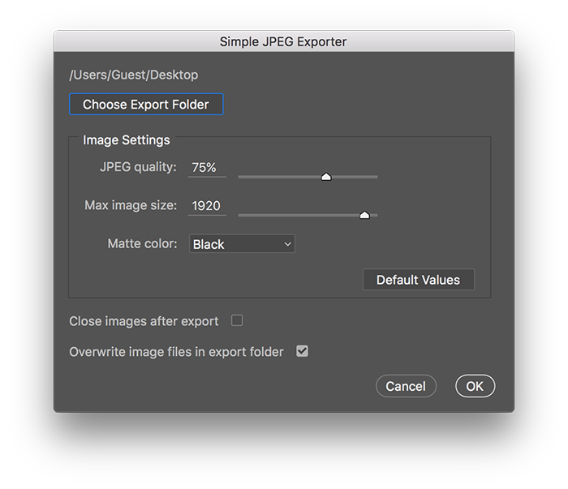

====================
Simple JPEG Exporter
====================

This is a Photoshop CS/CC script for exporting a JPEG from one
or more open images. The script hasn't been tested with Photoshop
versions earlier than Photoshop CS5 but it should be compatible.

It is intended to be used by artists to create JPEGs that are compatible with
various online application platforms such as
`callforentry.org <http://callforentry.org>`_.
It can save a lot of time if you need to resize and export several images.

Most of these application platforms require images to be 1920 pixels on the
longest side and output as JPEG files. This script will automatically scale
the image down (or up) so that the longest side (either width or height)
is equal to the specified nominal size.
Also, the color profile will be converted to sRGB.

It works like a batch export in that all currently opened images
will be exported.

Installation
------------

1. `Download <https://github.com/utlco/ps-jpegexport/archive/master.zip>`_
   the latest version.

2. Unzip/extract the downloaded archive file `ps-jpegexport-master.zip`.
   This will create a folder named `ps-jpegexport-master`.

3. From folder `ps-jpegexport-master` copy or move the script file
   **SimpleJPEGExport.jsx** to the Photoshop scripts folder.

4. Restart Photoshop.

Alternatively you can start the script in Photoshop from the menu via
File->Scripts->Browse... and then navigate to wherever you downloaded
the script. This is a good way to try it out before installing it into
the scripts folder.

Photoshop script folder location
................................

* MacOS, Linux:

   `/Applications/Adobe Photoshop CC 2015.5/Presets/Scripts`

   With recent Photoshop CC versions this folder is protected
   so you may be prompted to enter your password to complete
   the copy or move.

* Windows:

   `C:\\Users\\YourUserName\\.AppData\\Roaming\\Adobe\\Photoshop\\...\\Scripts`

If these locations are incorrect on your platform please open a new
`issue <https://github.com/utlco/ps-jpegexport/issues>`_ and I'll update
the docs.

Usage
-----

1. Open any images you want to export.

2. Select File->Scripts->SimpleJPegExport

The script will export all the images currently open in Photoshop.
The original images will not be modified.

From the script dialog you can choose the destination folder
for exported JPEGs. The default settings should be fine for
most applications. The exported JPEG will most likely be under
2mb. If it is larger than the maximum allowed by the application
then you can try lowering the JPEG quality setting a bit.

